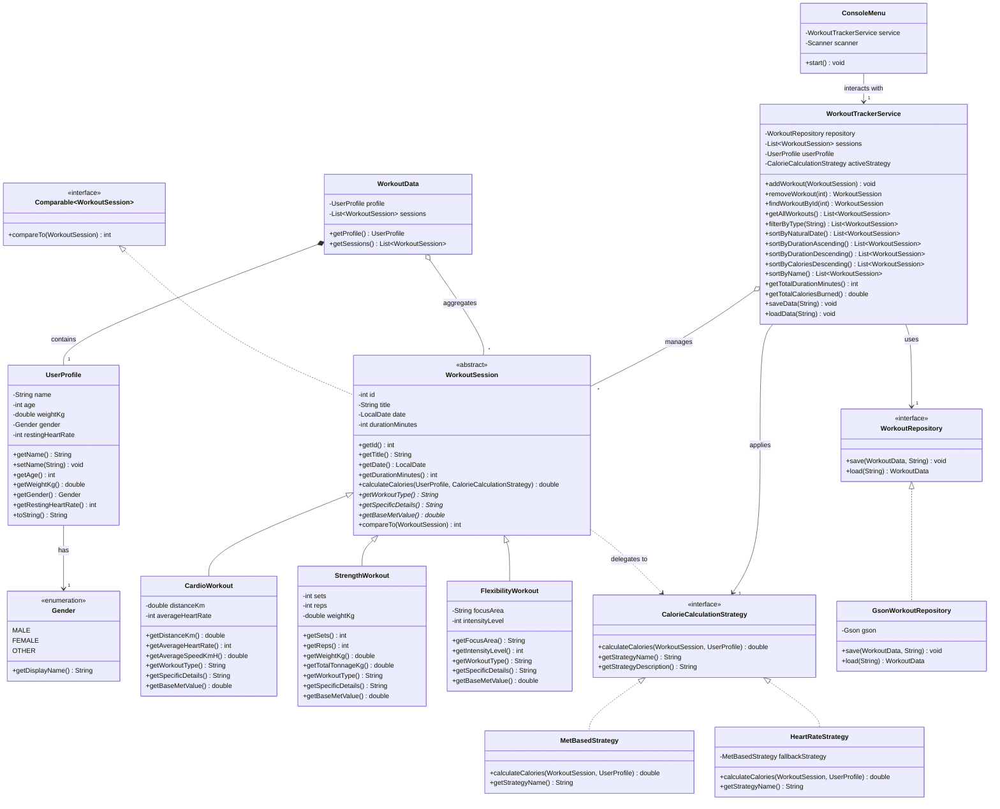

# FitTrack - UML Class Diagram

This diagram visualizes the object-oriented structure, class relationships, multiplicities, and the Strategy design pattern.

```mermaid
classDiagram
    direction TB

    %% Packages / Core Models
    class Gender {
        <<enumeration>>
        MALE
        FEMALE
        OTHER
        +getDisplayName() String
    }

    class UserProfile {
        -String name
        -int age
        -double weightKg
        -Gender gender
        -int restingHeartRate
        +getName() String
        +setName(String) void
        +getAge() int
        +getWeightKg() double
        +getGender() Gender
        +getRestingHeartRate() int
        +toString() String
    }

    UserProfile --> "1" Gender : has

    class Comparable~WorkoutSession~ {
        <<interface>>
        +compareTo(WorkoutSession) int
    }

    class WorkoutSession {
        <<abstract>>
        -int id
        -String title
        -LocalDate date
        -int durationMinutes
        +getId() int
        +getTitle() String
        +getDate() LocalDate
        +getDurationMinutes() int
        +calculateCalories(UserProfile, CalorieCalculationStrategy) double
        +getWorkoutType()* String
        +getSpecificDetails()* String
        +getBaseMetValue()* double
        +compareTo(WorkoutSession) int
    }

    Comparable~WorkoutSession~ <|.. WorkoutSession

    class CardioWorkout {
        -double distanceKm
        -int averageHeartRate
        +getDistanceKm() double
        +getAverageHeartRate() int
        +getAverageSpeedKmH() double
        +getWorkoutType() String
        +getSpecificDetails() String
        +getBaseMetValue() double
    }

    class StrengthWorkout {
        -int sets
        -int reps
        -double weightKg
        +getSets() int
        +getReps() int
        +getWeightKg() double
        +getTotalTonnageKg() double
        +getWorkoutType() String
        +getSpecificDetails() String
        +getBaseMetValue() double
    }

    class FlexibilityWorkout {
        -String focusArea
        -int intensityLevel
        +getFocusArea() String
        +getIntensityLevel() int
        +getWorkoutType() String
        +getSpecificDetails() String
        +getBaseMetValue() double
    }

    WorkoutSession <|-- CardioWorkout
    WorkoutSession <|-- StrengthWorkout
    WorkoutSession <|-- FlexibilityWorkout

    %% Strategy Pattern
    class CalorieCalculationStrategy {
        <<interface>>
        +calculateCalories(WorkoutSession, UserProfile) double
        +getStrategyName() String
        +getStrategyDescription() String
    }

    class MetBasedStrategy {
        +calculateCalories(WorkoutSession, UserProfile) double
        +getStrategyName() String
    }

    class HeartRateStrategy {
        -MetBasedStrategy fallbackStrategy
        +calculateCalories(WorkoutSession, UserProfile) double
        +getStrategyName() String
    }

    CalorieCalculationStrategy <|.. MetBasedStrategy
    CalorieCalculationStrategy <|.. HeartRateStrategy
    WorkoutSession ..> CalorieCalculationStrategy : delegates to

    %% Persistence
    class WorkoutData {
        -UserProfile profile
        -List~WorkoutSession~ sessions
        +getProfile() UserProfile
        +getSessions() List~WorkoutSession~
    }

    WorkoutData *-- "1" UserProfile : contains
    WorkoutData o-- "*" WorkoutSession : aggregates

    class WorkoutRepository {
        <<interface>>
        +save(WorkoutData, String) void
        +load(String) WorkoutData
    }

    class GsonWorkoutRepository {
        -Gson gson
        +save(WorkoutData, String) void
        +load(String) WorkoutData
    }

    WorkoutRepository <|.. GsonWorkoutRepository

    %% Service & UI
    class WorkoutTrackerService {
        -WorkoutRepository repository
        -List~WorkoutSession~ sessions
        -UserProfile userProfile
        -CalorieCalculationStrategy activeStrategy
        +addWorkout(WorkoutSession) void
        +removeWorkout(int) WorkoutSession
        +findWorkoutById(int) WorkoutSession
        +getAllWorkouts() List~WorkoutSession~
        +filterByType(String) List~WorkoutSession~
        +sortByNaturalDate() List~WorkoutSession~
        +sortByDurationAscending() List~WorkoutSession~
        +sortByDurationDescending() List~WorkoutSession~
        +sortByCaloriesDescending() List~WorkoutSession~
        +sortByName() List~WorkoutSession~
        +getTotalDurationMinutes() int
        +getTotalCaloriesBurned() double
        +saveData(String) void
        +loadData(String) void
    }

    WorkoutTrackerService --> "1" WorkoutRepository : uses
    WorkoutTrackerService o-- "*" WorkoutSession : manages
    WorkoutTrackerService --> "1" CalorieCalculationStrategy : applies

    class ConsoleMenu {
        -WorkoutTrackerService service
        -Scanner scanner
        +start() void
    }

    ConsoleMenu --> "1" WorkoutTrackerService : interacts with
```
